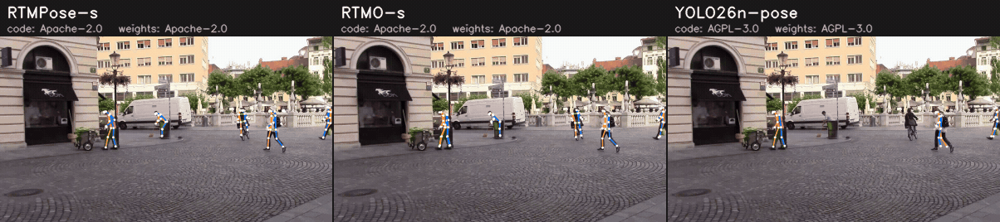
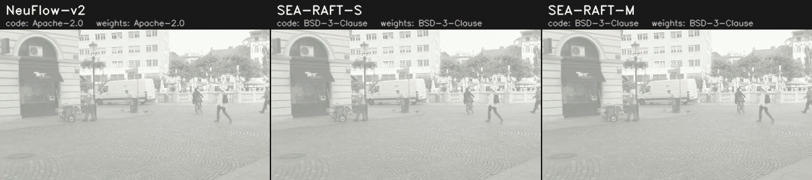
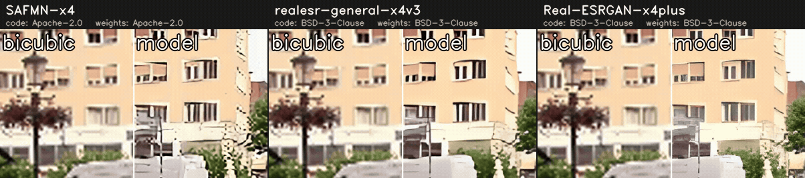
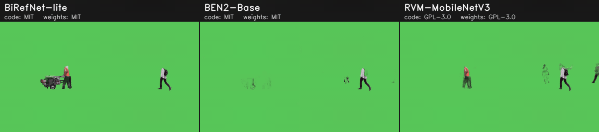
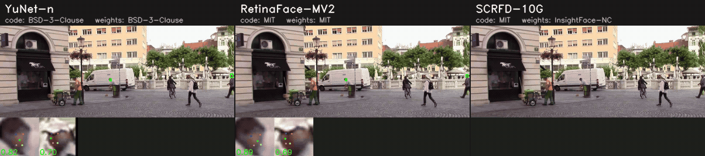
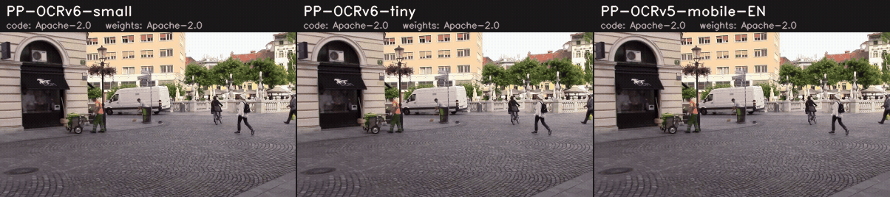
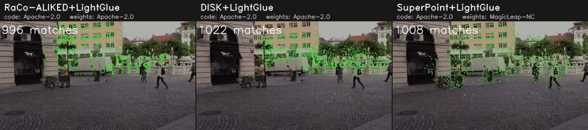
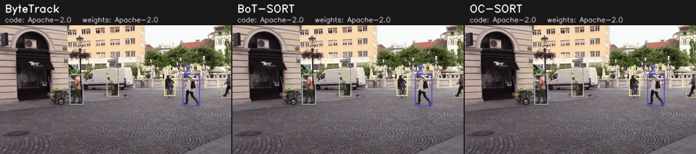

# ml_model_collection

> A collection of reproducible, comparable, and deployment-ready ML models.

Pick a model by **Task × License × Hardware requirements × Runtime** — not by scrolling through hundreds of files.
Every number below was measured by a script in this repo, under the conditions recorded next to it.


<sub>Current real-time SOTA, small sizes: same frames, same tile size, six models ([line-up](object_detection/comparison.yaml), [why these](docs/sota/object_detection.md)). Regenerate with `python tools/make_comparison.py --task object_detection --input assets/demo.mp4`.
Video: "Road traffic on Stritarjeva street" by Sounds of Changes, [CC BY 3.0](https://creativecommons.org/licenses/by/3.0), via [Wikimedia Commons](https://commons.wikimedia.org/wiki/File:Road_traffic_on_Stritarjeva_street.webm) — trimmed, scaled, and annotated with model outputs ([details](assets/README.md)).</sub>

## Tasks

<!-- BEGIN:task_index -->
| Task | Models | Weights licenses | Best measured accuracy | Fastest on T4 TensorRT FP16<br>(model-only latency) |
|---|---|---|---|---|
| [Object detection](#object-detection) | 14 | 🟢11 🟡2 ⚪1 | COCO AP **53.5** — RT-DETRv4-M | RF-DETR-N — 3.7 ms |
| [Segmentation](#segmentation) | 5 | 🟢4 🔴1 | COCO mask AP **40.1** — RF-DETR-Seg-N | RF-DETR-Seg-N — 5.1 ms |
| [Depth estimation](#depth-estimation) | 4 | 🟢3 🔴1 | – | Depth-Anything-3-S — 5.2 ms |
| [Pose estimation](#pose-estimation) | 3 | 🟢2 🟡1 | COCO keypoint AP **68.0** — RTMPose-s | YOLO26n-pose — 4.5 ms |
| [Optical flow](#optical-flow) | 3 | 🟢3 | Sintel final EPE **2.777** — NeuFlow-v2 | NeuFlow-v2 — 16.5 ms |
| [Super-resolution (x4)](#super-resolution-x4) | 3 | 🟢3 | – | – |
| [Background removal / matting](#background-removal--matting) | 3 | 🟢2 🟡1 | – | – |
| [Face detection](#face-detection) | 3 | 🟢2 🔴1 | – | – |
| [OCR (scene text)](#ocr-scene-text) | 3 | 🟢3 | – | – |
| [Feature matching](#feature-matching) | 3 | 🟢2 🔴1 | – | – |
| [Multi-object tracking](#multi-object-tracking) | 3 | 🟢3 | – | – |
<!-- END:task_index -->

<sub>🟢 permissive · 🟡 copyleft · 🔴 non-commercial / restricted · ⚪ unknown (weights license). Accuracy and latency come from the recorded `accuracy.yaml` / `benchmarks.yaml` files; each task section below has the full table with conditions. Every task has a comparison GIF on the same clip.</sub>

## Object detection

<!-- BEGIN:object_detection_table -->
| Model | Code license | Weights license | Input | COCO mAP<br>(reported) | COCO mAP<br>(measured, ONNX) | Peak VRAM<br>(measured) | GTX 1660 Ti Laptop<br>onnxruntime-cuda FP32 · ms / FPS | Tesla T4 (Colab)<br>onnxruntime-cuda FP32 · ms / FPS | Tesla T4 (Colab)<br>onnxruntime-tensorrt FP16 · ms / FPS |
|---|---|---|---|---|---|---|---|---|---|
| [DEIM-D-FINE-S](object_detection/deim_dfine_s) | 🟢 Apache-2.0 | 🟢 Apache-2.0* | 640×640 | [49.0](https://github.com/Intellindust-AI-Lab/DEIM/blob/09d35d53d39ee3145a1e61e3a989b28b9468d1dd/README.md) | **48.7** | 299 MB (Tiny, GTX 1660 Ti CUDA FP32)<br>335 MB (Tiny, T4 CUDA FP32)<br>415 MB (Tiny, T4 TRT FP16) | 21.7 / 46 | 16.7 / 60 | 6.2 / 162 |
| [D-FINE-N](object_detection/dfine_n) | 🟢 Apache-2.0 | 🟢 Apache-2.0 | 640×640 | [42.8](https://github.com/Peterande/D-FINE/blob/956d1709314c2c6a4df6f34de232054578a7449f/README.md) | **42.6** | 177 MB (Tiny, GTX 1660 Ti CUDA FP32)<br>219 MB (Tiny, T4 CUDA FP32)<br>405 MB (Tiny, T4 TRT FP16) | 13.4 / 74 | 9.8 / 102 | 5.4 / 184 |
| [D-FINE-S](object_detection/dfine_s) | 🟢 Apache-2.0 | 🟢 Apache-2.0 | 640×640 | [48.5](https://github.com/Peterande/D-FINE/blob/956d1709314c2c6a4df6f34de232054578a7449f/README.md) | **48.3** | 299 MB (Tiny, GTX 1660 Ti CUDA FP32)<br>335 MB (Tiny, T4 CUDA FP32)<br>425 MB (Tiny, T4 TRT FP16) | 22.3 / 45 | 17.3 / 58 | 6.8 / 148 |
| [LLMDet-T](object_detection/llmdet_tiny) 🔤 ⚠️ | 🟢 Apache-2.0 | 🟢 Apache-2.0 | 800×1333 | – | **1.5** | 5939 MB (Consumer, GTX 1660 Ti CUDA FP32)<br>6257 MB (Consumer, T4 CUDA FP32)<br>1435 MB (Tiny, T4 TRT FP16) | 2655.8 / 0 | 728.6 / 1 | 172.0 / 6 |
| [OWLv2-B/16](object_detection/owlv2_b16) 🔤 | 🟢 Apache-2.0 | 🟢 Apache-2.0 | 960×960 | – | **45.7** | 3477 MB (Light, GTX 1660 Ti CUDA FP32)<br>3519 MB (Light, T4 CUDA FP32)<br>763 MB (Tiny, T4 TRT FP16) | 660.1 / 2 | 510.2 / 2 | 84.5 / 12 |
| [RF-DETR-N](object_detection/rfdetr_n) | 🟢 Apache-2.0 | 🟢 Apache-2.0 | 384×384 | [48.4](https://github.com/roboflow/rf-detr/blob/5f441831aaf23a68f40128ad0a2e27cb44e52640/README.md) | **47.9** | 355 MB (Tiny, T4 CUDA FP32)<br>423 MB (Tiny, T4 TRT FP16) | – | 13.2 / 76 | 3.7 / 270 |
| [RF-DETR-S](object_detection/rfdetr_s) | 🟢 Apache-2.0 | 🟢 Apache-2.0 | 512×512 | [53.0](https://github.com/roboflow/rf-detr/blob/5f441831aaf23a68f40128ad0a2e27cb44e52640/README.md) | **52.6** | 489 MB (Tiny, T4 CUDA FP32)<br>433 MB (Tiny, T4 TRT FP16) | – | 24.7 / 40 | 5.6 / 179 |
| [RT-DETR-R18](object_detection/rtdetr_r18vd) | 🟢 Apache-2.0 | 🟢 Apache-2.0 | 640×640 | [46.5](https://huggingface.co/PekingU/rtdetr_r18vd/blob/ac77a11ff0170a41b771c03264987f8ce2b0d753/README.md) | **46.2** | 361 MB (Tiny, T4 CUDA FP32)<br>467 MB (Tiny, T4 TRT FP16) | – | 23.1 / 43 | 6.7 / 149 |
| [RT-DETRv4-M](object_detection/rtdetrv4_m) | 🟢 Apache-2.0 | 🟢 Apache-2.0* | 640×640 | [53.7](https://github.com/RT-DETRs/RT-DETRv4/blob/55fefaaed7efe2a5f72d0a18fd4e05965e35c292/README.md) | **53.5** | 383 MB (Tiny, T4 CUDA FP32)<br>441 MB (Tiny, T4 TRT FP16) | – | 26.9 / 37 | 8.7 / 115 |
| [RT-DETRv4-S](object_detection/rtdetrv4_s) | 🟢 Apache-2.0 | 🟢 Apache-2.0* | 640×640 | [49.8](https://github.com/RT-DETRs/RT-DETRv4/blob/55fefaaed7efe2a5f72d0a18fd4e05965e35c292/README.md) | **49.6** | 335 MB (Tiny, T4 CUDA FP32)<br>415 MB (Tiny, T4 TRT FP16) | – | 16.8 / 59 | 6.8 / 148 |
| [SSDLite320-MobileNetV3](object_detection/ssdlite320_mobilenet_v3_large) | 🟢 BSD-3-Clause | ⚪ unknown | 320×320 | [21.3](https://github.com/pytorch/vision/blob/6da25ff876100d36f23472f5762d5f306c47d735/torchvision/models/detection/ssdlite.py) | **21.1** | 249 MB (Tiny, T4 CUDA FP32) | – | 20.9 / 48 | – |
| [YOLO11n](object_detection/yolo11n) | 🟡 AGPL-3.0 | 🟡 AGPL-3.0* | 640×640 | [39.5](https://github.com/ultralytics/ultralytics/blob/50ca85e03bc669c694c474ab91168f9b5425d9a8/docs/en/models/yolo11.md) | **38.6** | 239 MB (Tiny, T4 CUDA FP32)<br>403 MB (Tiny, T4 TRT FP16) | – | 7.2 / 138 | 4.9 / 205 |
| [YOLO26n](object_detection/yolo26n) | 🟡 AGPL-3.0 | 🟡 AGPL-3.0 | 640×640 | [40.1](https://github.com/ultralytics/ultralytics/blob/50ca85e03bc669c694c474ab91168f9b5425d9a8/README.md) | **40.0** | 247 MB (Tiny, T4 CUDA FP32)<br>401 MB (Tiny, T4 TRT FP16) | – | 8.3 / 121 | 4.5 / 223 |
| [YOLOX-S](object_detection/yolox_s) | 🟢 Apache-2.0 | 🟢 Apache-2.0* | 640×640 | [40.5](https://github.com/Megvii-BaseDetection/YOLOX/blob/6ddff4824372906469a7fae2dc3206c7aa4bbaee/README.md) | **40.3** | 249 MB (Tiny, T4 CUDA FP32)<br>387 MB (Tiny, T4 TRT FP16) | – | 11.2 / 89 | 5.4 / 184 |
<!-- END:object_detection_table -->

- ⚠️ = known issue, see the model's `model.yaml` (`known_issue`) before using it.
- 🔤 = open-vocabulary (prompted with the 80 COCO class names here; COCO AP is zero-shot unless the model's notes say otherwise).
- 🟢 permissive · 🟡 copyleft · 🔴 restricted · ⚪ unknown. `*` = the weights are published from a repository/release under that license, but upstream does not state a separate license for the weights. See [docs/licenses.md](docs/licenses.md).
- **COCO mAP (reported)** is copied from upstream (linked). **COCO mAP (measured, ONNX)** is measured here by [`tools/evaluate.py`](tools/evaluate.py) on COCO val2017 with the *exported ONNX file and this repo's pre/post-processing* (score ≥ 0.001, 100 dets/image, pycocotools) — it checks the artifact you would deploy, not the upstream PyTorch model. For all non-open-vocabulary detectors the two agree within 0.1–0.9 AP.
- **ms / FPS**: mean `session.run` latency, batch 1, ONNX Runtime 1.22, CUDA FP32 or TensorRT FP16 (full conditions in each model's `benchmarks.yaml`). Graphs differ in how much post-processing they contain: DEIM / RT-DETRv4 / YOLO26n include top-k selection, SSDLite includes resize + NMS, the others end at raw predictions (decoded in NumPy, see `e2e_ms_mean` in `benchmarks.yaml`).
- The **TensorRT FP16** column is the closest to upstream "T4 / TensorRT / FP16" tables, but it runs through ONNX Runtime's TensorRT EP and includes whatever post-processing the graph contains, so small differences to upstream numbers are expected.
- **Peak VRAM**: device memory delta during session creation + inference, CUDA context included ([method](docs/hardware.md#how-vram-is-measured)). It is valid only for the listed hardware/runtime/precision/batch/input.

Tables are generated from metadata by `python tools/build_readme.py`; do not edit them by hand.

How these models relate to the current state of the art, and which models are planned next: [docs/sota/object_detection.md](docs/sota/object_detection.md) (surveyed 2026-09-30).

## Depth estimation


<!-- BEGIN:depth_estimation_table -->
| Model | Code license | Weights license | Output | Input | NYUv2 AbsRel ↓<br>(reported) | NYUv2 AbsRel ↓ / δ1<br>(measured, ONNX, aligned) | Peak VRAM<br>(measured) | Tesla T4 (Colab)<br>onnxruntime-cuda FP32 · ms / FPS | Tesla T4 (Colab)<br>onnxruntime-tensorrt FP16 · ms / FPS |
|---|---|---|---|---|---|---|---|---|---|
| [Depth-Anything-3-S](depth_estimation/depth_anything_3_small) | 🟢 Apache-2.0 | 🟢 Apache-2.0 | relative (depth) | 280×504 | – | – | 507 MB (Tiny, T4 CUDA FP32)<br>447 MB (Tiny, T4 TRT FP16) | 22.1 / 45 | 5.2 / 192 |
| [Depth-Anything-V2-B](depth_estimation/depth_anything_v2_base) | 🟢 Apache-2.0 | 🔴 CC-BY-NC-4.0 | relative (disparity) | 518×924 | [0.049](https://arxiv.org/abs/2406.09414) | – | 2099 MB (Light, T4 CUDA FP32)<br>697 MB (Tiny, T4 TRT FP16) | 297.3 / 3 | 48.1 / 21 |
| [Depth-Anything-V2-S](depth_estimation/depth_anything_v2_small) | 🟢 Apache-2.0 | 🟢 Apache-2.0 | relative (disparity) | 518×924 | [0.053](https://arxiv.org/abs/2406.09414) | – | 1013 MB (Tiny, T4 CUDA FP32)<br>495 MB (Tiny, T4 TRT FP16) | 119.4 / 8 | 18.9 / 53 |
| [MoGe-2-S](depth_estimation/moge2_vits) | 🟢 MIT | 🟢 MIT | metric (m) | 720×1280 | – | – | 1503 MB (Tiny, T4 CUDA FP32) | 203.4 / 5 | – |
<!-- END:depth_estimation_table -->

Depth-Anything-3-S is the newest (2025-11). Depth-Anything-V2-S and -B share code and architecture, but only **S** has Apache-2.0 weights — **B** is CC-BY-NC-4.0. Relative outputs are per-frame normalised in the GIF. Survey: [docs/sota/depth_estimation.md](docs/sota/depth_estimation.md).

## Segmentation


<!-- BEGIN:segmentation_table -->
| Model | Kind | Code license | Weights license | Input | Accuracy (reported) | Accuracy<br>(measured, ONNX) | Peak VRAM<br>(measured) | Tesla T4 (Colab)<br>onnxruntime-cuda FP32 · ms / FPS | Tesla T4 (Colab)<br>onnxruntime-tensorrt FP16 · ms / FPS |
|---|---|---|---|---|---|---|---|---|---|
| [EdgeTAM](segmentation/edgetam) | promptable | 🟢 Apache-2.0 | 🟢 Apache-2.0 | 1024×1024 | [71.7](https://github.com/facebookresearch/EdgeTAM/blob/7711e012a30a2402c4eaab637bdb00a521302c91/README.md) SA-V test J&F | **33.9** COCO mask AP (boxes from dfine_n) | 1393 MB (Tiny, T4 CUDA FP32)<br>801 MB (Tiny, T4 TRT FP16) | 79.3 / 13 | 28.8 / 35 |
| [Mask2Former-SwinT (ADE20K)](segmentation/mask2former_swin_t_ade) | semantic | 🟢 MIT | 🟢 MIT* | 512×512 | [47.7](https://github.com/facebookresearch/Mask2Former/blob/9b0651c6c1d5b3af2e6da0589b719c514ec0d69a/MODEL_ZOO.md) ADE20K val mIoU | **46.5** ADE20K mIoU | 1375 MB (Tiny, T4 CUDA FP32)<br>573 MB (Tiny, T4 TRT FP16) | 108.2 / 9 | 42.2 / 24 |
| [RF-DETR-Seg-N](segmentation/rfdetr_seg_n) | instance | 🟢 Apache-2.0 | 🟢 Apache-2.0 | 312×312 | [40.3](https://github.com/roboflow/rf-detr/blob/5f441831aaf23a68f40128ad0a2e27cb44e52640/README.md) COCO val2017 mask AP | **40.1** COCO mask AP | 407 MB (Tiny, T4 CUDA FP32)<br>431 MB (Tiny, T4 TRT FP16) | 21.0 / 48 | 5.1 / 196 |
| [SAM2.1-Hiera-T](segmentation/sam21_hiera_tiny) | promptable | 🟢 Apache-2.0 | 🟢 Apache-2.0 | 1024×1024 | [76.5](https://github.com/facebookresearch/sam2/blob/2b90b9f5ceec907a1c18123530e92e794ad901a4/README.md) SA-V test J&F | **35.5** COCO mask AP (boxes from dfine_n) | 3359 MB (Light, T4 CUDA FP32)<br>1123 MB (Tiny, T4 TRT FP16) | 169.1 / 6 | 55.3 / 18 |
| [SegFormer-B0 (ADE20K)](segmentation/segformer_b0_ade) | semantic | 🔴 NVIDIA-NC | 🔴 NVIDIA-NC* | 512×512 | [37.4](https://arxiv.org/abs/2105.15203) ADE20K val mIoU | **35.9** ADE20K mIoU | 485 MB (Tiny, T4 CUDA FP32)<br>461 MB (Tiny, T4 TRT FP16) | 13.8 / 72 | 6.3 / 159 |
<!-- END:segmentation_table -->

Instance (RF-DETR-Seg) and semantic (ADE20K, 150 classes) models side by side. SegFormer-B0 is tiny and has a ready-made ONNX on the Hub, but its code **and** weights are NVIDIA non-commercial — it is here as a license-trap example. Survey: [docs/sota/segmentation.md](docs/sota/segmentation.md).

## Pose estimation



<!-- BEGIN:pose_estimation_table -->
| Model | Kind | Code license | Weights license | Input | COCO kpt AP<br>(reported) | COCO kpt AP<br>(measured, ONNX) | Peak VRAM<br>(measured) | Tesla T4 (Colab)<br>onnxruntime-cuda FP32 · ms / FPS | Tesla T4 (Colab)<br>onnxruntime-tensorrt FP16 · ms / FPS |
|---|---|---|---|---|---|---|---|---|---|
| [RTMO-s](pose_estimation/rtmo_s) | one-stage | 🟢 Apache-2.0 | 🟢 Apache-2.0* | 640×640 | [68.6](https://github.com/open-mmlab/mmpose/blob/759b39c13fea6ba094afc1fa932f51dc1b11cbf9/projects/rtmo/README.md) | **67.9** | 269 MB (Tiny, T4 CUDA FP32)<br>1183 MB (Tiny, T4 TRT FP16) | 13.6 / 74<br>e2e 15.5 ms | 5.5 / 183<br>e2e 6.7 ms |
| [RTMPose-s](pose_estimation/rtmpose_s) | top-down | 🟢 Apache-2.0 | 🟢 Apache-2.0* | 256×192 | [69.7](https://github.com/open-mmlab/mmpose/blob/759b39c13fea6ba094afc1fa932f51dc1b11cbf9/projects/rtmpose/README.md) | **68.0** (persons from dfine_n) | 361 MB (Tiny, T4 CUDA FP32)<br>475 MB (Tiny, T4 TRT FP16) | 13.0 / 77 (14 crops)<br>e2e 56.5 ms | 6.3 / 158 (14 crops)<br>e2e 35.6 ms |
| [YOLO26n-pose](pose_estimation/yolo26n_pose) | one-stage | 🟡 AGPL-3.0 | 🟡 AGPL-3.0 | 640×640 | [57.2](https://docs.ultralytics.com/tasks/pose/) | **57.0** | 237 MB (Tiny, T4 CUDA FP32)<br>401 MB (Tiny, T4 TRT FP16) | 10.0 / 100<br>e2e 11.3 ms | 4.5 / 225<br>e2e 6.2 ms |
<!-- END:pose_estimation_table -->

COCO-17 keypoints. Speed cells are model-only ms / FPS plus end-to-end ms per frame (pre/post-processing included; for top-down RTMPose that means D-FINE-N person detection plus one batched pass over every person crop in the demo frame). RTMPose's measured AP also covers the whole pipeline with D-FINE-N boxes; RTMO and YOLO26n-pose are one-stage. The mmpose ONNX files are **Body7** weights (7 datasets, each with its own terms). Survey: [docs/sota/pose_estimation.md](docs/sota/pose_estimation.md).

## Optical flow



<!-- BEGIN:optical_flow_table -->
| Model | Code license | Weights license | Training data | Input | Sintel train EPE<br>clean / final (reported) | Sintel train EPE<br>clean / final (measured, ONNX) | Peak VRAM<br>(measured) | Tesla T4 (Colab)<br>onnxruntime-cuda FP32 · ms / FPS | Tesla T4 (Colab)<br>onnxruntime-tensorrt FP16 · ms / FPS |
|---|---|---|---|---|---|---|---|---|---|
| [NeuFlow-v2](optical_flow/neuflow_v2) | 🟢 Apache-2.0 | 🟢 Apache-2.0* | FlyingThings3D | 432×768 | [1.24 / 2.67](https://arxiv.org/abs/2408.10161) | **1.28 / 2.78** | 785 MB (Tiny, T4 CUDA FP32)<br>523 MB (Tiny, T4 TRT FP16) | 40.4 / 25 | 16.5 / 60 |
| [SEA-RAFT-M](optical_flow/sea_raft_m) | 🟢 BSD-3-Clause | 🟢 BSD-3-Clause | TartanAir, FlyingChairs, FlyingThings3D | 432×768 | – | **1.29 / 3.71** | 1053 MB (Tiny, T4 CUDA FP32)<br>603 MB (Tiny, T4 TRT FP16) | 160.5 / 6 | 40.1 / 25 |
| [SEA-RAFT-S](optical_flow/sea_raft_s) | 🟢 BSD-3-Clause | 🟢 BSD-3-Clause | TartanAir, FlyingChairs, FlyingThings3D | 432×768 | [1.27 / 3.74](https://arxiv.org/abs/2405.14793) | **1.29 / 3.59** | 983 MB (Tiny, T4 CUDA FP32)<br>579 MB (Tiny, T4 TRT FP16) | 103.2 / 10 | 27.8 / 36 |
<!-- END:optical_flow_table -->

Dense two-frame flow, previous frame → current frame; colour = direction, saturation = magnitude (≥ 20 px fully saturated), blended over the grayscale frame. All three checkpoints were trained without Sintel, so the Sintel-train EPE is zero-shot; upstream evaluates at the native 1024×436, the measured column runs the deployed fixed 432×768 graph. **Every released flow checkpoint is trained on FlyingChairs / FlyingThings3D, whose terms are research-only** — the code and weights licenses do not change that. Survey: [docs/sota/optical_flow.md](docs/sota/optical_flow.md).

## Super-resolution (x4)



<!-- BEGIN:super_resolution_table -->
| Model | Kind | Code license | Weights license | Training data | PSNR-Y x4 Set5 / Set14 / Urban100<br>(reported) | PSNR-Y x4 Set5 / Set14 / Urban100<br>(measured, ONNX) | Peak VRAM<br>(measured) |
|---|---|---|---|---|---|---|---|
| [Real-ESRGAN-x4plus](super_resolution/real_esrgan_x4plus) | real-world (GAN) | 🟢 BSD-3-Clause | 🟢 BSD-3-Clause* | DF2K (DIV2K + Flickr2K) + OST | – | – | not measured |
| [realesr-general-x4v3](super_resolution/realesr_general_x4v3) | real-world (GAN) | 🟢 BSD-3-Clause | 🟢 BSD-3-Clause* | not documented upstream | – | – | not measured |
| [SAFMN-x4](super_resolution/safmn_x4) | PSNR-oriented | 🟢 Apache-2.0 | 🟢 Apache-2.0* | DF2K (DIV2K + Flickr2K) | [32.18 / 28.60 / 25.97](https://arxiv.org/abs/2302.13800) | – | not measured |
<!-- END:super_resolution_table -->

Each tile is a zoomed crop: left half bicubic upscaling of the low-resolution input, right half the model. Video runs and benchmarks downscale every frame to 320×180 (bicubic) and upscale it x4 to 1280×720; the graphs themselves take any size. PSNR-Y follows BasicSR (BT.601 Y, 4 px border). The Real-ESRGAN models are GAN-trained for real-world images, so PSNR is not their target. **DIV2K (in DF2K) is "for academic research purpose only"** — permissive code and weights do not change the training-data terms. Survey: [docs/sota/super_resolution.md](docs/sota/super_resolution.md).

## Background removal / matting



<!-- BEGIN:background_removal_table -->
| Model | Kind | Code license | Weights license | Training data | Input | DIS-VD S<sub>α</sub> / wF<br>(reported) | DIS-VD S<sub>α</sub> / wF / MAE<br>(measured, ONNX) | Peak VRAM<br>(measured) |
|---|---|---|---|---|---|---|---|---|
| [BEN2-Base](background_removal/ben2_base) | image (dichotomous segmentation) | 🟢 MIT | 🟢 MIT | DIS5K + 22K proprietary images | 1024×1024 | – | – | not measured |
| [BiRefNet-lite](background_removal/birefnet_lite) | image (dichotomous segmentation) | 🟢 MIT | 🟢 MIT | DIS5K, P3M-10k, DUTS, HRSOD, UHRSD, HRS10K and others (general model) | 1024×1024 | [0.882 / 0.83](https://github.com/ZhengPeng7/BiRefNet/blob/ebcc0bc8ec7fe919cec829f2dea656b3078acddc/README.md) | – | not measured |
| [RVM-MobileNetV3](background_removal/rvm_mobilenetv3) | video (recurrent human matting) | 🟡 GPL-3.0 | 🟡 GPL-3.0* | VideoMatte240K, Distinctions-646, Adobe Image Matting, COCO, YouTubeVIS 2021, Supervisely Person | 720×1280 | – | – | not measured |
<!-- END:background_removal_table -->

Predicted alpha composited over a solid green background. BiRefNet-lite and BEN2 are single-image dichotomous-segmentation models (any salient object, 1024×1024 input); RVM is a recurrent *human* video matting model (source resolution, state carried across frames), so DIS-VD — a general-object benchmark — is outside what it was trained for. **DIS5K, used by BiRefNet and BEN2, is non-commercial**; RMBG-2.0 (same architecture as BiRefNet) has CC BY-NC 4.0 weights and is not included. Survey: [docs/sota/background_removal.md](docs/sota/background_removal.md).

## Face detection



<!-- BEGIN:face_detection_table -->
| Model | Code license | Weights license | Input | WIDER FACE val AP E / M / H<br>(reported) | WIDER FACE val AP E / M / H<br>(measured, ONNX) | Peak VRAM<br>(measured) |
|---|---|---|---|---|---|---|
| [RetinaFace-MV2](face_detection/retinaface_mv2) | 🟢 MIT | 🟢 MIT* | source size | [94.0 / 92.3 / 83.6](https://github.com/yakhyo/retinaface-pytorch/blob/4cd6e3471e5bac794637290a530566f463db4762/README.md) | – | not measured |
| [SCRFD-10G](face_detection/scrfd_10g) | 🟢 MIT | 🔴 InsightFace-NC | 640×640 | [95.4 / 94.0 / 82.8](https://github.com/deepinsight/insightface/blob/1480e705287bc5d59f923b46c260ec6e3e4150f6/detection/scrfd/README.md) | – | not measured |
| [YuNet-n](face_detection/yunet_n) | 🟢 BSD-3-Clause | 🟢 BSD-3-Clause* | source size | [89.2 / 88.3 / 81.1](https://github.com/ShiqiYu/libfacedetection.train/blob/02246e79b1e976c83d1e135a85e0628120c93769/README.md) | – | not measured |
<!-- END:face_detection_table -->

Boxes plus five landmarks; the strip at the bottom of each tile enlarges the highest-scoring faces (faces in the demo clip are ~10 px tall). YuNet and RetinaFace run at the source resolution, SCRFD at 640×640 (its graph's outputs are fixed), each as in its upstream WIDER FACE protocol. **WIDER FACE — the training set of all three — is CC BY-NC-ND**, and **InsightFace's pretrained models (SCRFD) are non-commercial research only**; mirrors that relabel SCRFD as MIT contradict upstream. Survey: [docs/sota/face_detection.md](docs/sota/face_detection.md).

## OCR (scene text)



<!-- BEGIN:ocr_table -->
| Model | Code license | Weights license | Languages | PaddleOCR benchmark det Hmean / rec acc<br>(reported, not ICDAR) | ICDAR2015 det H-mean / end-to-end H-mean<br>(measured, ONNX) | Peak VRAM<br>(measured) |
|---|---|---|---|---|---|---|
| [PP-OCRv5-mobile-EN](ocr/ppocrv5_mobile_en) | 🟢 Apache-2.0 | 🟢 Apache-2.0 | English (436-entry dictionary) | [75.2](https://huggingface.co/PaddlePaddle/PP-OCRv6_small_det_onnx/blob/28fe5895c24fd108c19eb3e8479f4ab385fbfc62/README.md) / – | – | not measured |
| [PP-OCRv6-small](ocr/ppocrv6_small) | 🟢 Apache-2.0 | 🟢 Apache-2.0 | multilingual (rec card: 50 languages) | [84.1](https://huggingface.co/PaddlePaddle/PP-OCRv6_small_det_onnx/blob/28fe5895c24fd108c19eb3e8479f4ab385fbfc62/README.md) / [81.3](https://huggingface.co/PaddlePaddle/PP-OCRv6_small_rec_onnx/blob/b8f84f0b80c529de40b4fbb3544b84fa7233a513/README.md) | – | not measured |
| [PP-OCRv6-tiny](ocr/ppocrv6_tiny) | 🟢 Apache-2.0 | 🟢 Apache-2.0 | multilingual (6904-entry dictionary) | [80.6](https://huggingface.co/PaddlePaddle/PP-OCRv6_tiny_det_onnx/blob/2ba1506c0380b8f0b03dd142459aac66d4421f6c/README.md) / [73.5](https://huggingface.co/PaddlePaddle/PP-OCRv6_tiny_rec_onnx/blob/2612ab37152ae0a677521bae4e1e3d4fb4cf7c30/README.md) | – | not measured |
<!-- END:ocr_table -->

Detection (DB) + recognition (CTC) pipelines from PaddleOCR's official ONNX files, re-implemented pre/post-processing (no Paddle dependency). Speed cells: model-only = text detector; end-to-end = detection + cropping + batched recognition of every line in the demo frame. The reported numbers are PaddleOCR's own multi-scenario benchmark, not ICDAR; the measured ICDAR2015 numbers are zero-shot and penalise line-level detectors, since ICDAR2015 annotates single words. Survey: [docs/sota/ocr.md](docs/sota/ocr.md).

## Feature matching



<!-- BEGIN:feature_matching_table -->
| Model | Code license | Weights license | Training data | HPatches H-AUC @1/3/5 px<br>(reported, DLT) | HPatches H-AUC @1/3/5 px<br>(measured, ONNX) | Peak VRAM<br>(measured) |
|---|---|---|---|---|---|---|
| [DISK+LightGlue](feature_matching/disk_lightglue) | 🟢 Apache-2.0 | 🟢 Apache-2.0 | MegaDepth | – | – | not measured |
| [RaCo-ALIKED+LightGlue](feature_matching/raco_aliked_lightglue) | 🟢 Apache-2.0 | 🟢 Apache-2.0* | Oxford-Paris 1M distractors (synthetic homographies), MegaDepth | [40.4 / 71.1 / 80.5](https://github.com/cvg/RaCo/blob/35790eb48074ed14839d0fb496b8806caa4e766b/README.md) | – | not measured |
| [SuperPoint+LightGlue](feature_matching/superpoint_lightglue) | 🟢 Apache-2.0 | 🔴 MagicLeap-NC | MS-COCO 2014 + synthetic shapes (SuperPoint); MegaDepth (LightGlue) | [35.1 / 67.2 / 77.6](https://github.com/cvg/glue-factory/blob/2d17e3b3bd7d30f0c828d4c4d3eac4ecefbf283d/README.md) | – | not measured |
<!-- END:feature_matching_table -->

Sparse keypoints + LightGlue between consecutive frames (each line: previous → current position, colour = match score). End-to-end ONNX pipelines from [fabio-sim/LightGlue-ONNX](https://github.com/fabio-sim/LightGlue-ONNX), 1024 keypoints, 448×800 per frame for video. HPatches uses the glue-factory protocol (short side 480, weighted DLT, corner-error AUC). **SuperPoint's weights are Magic Leap non-commercial** — included only as the classic reference; RaCo-ALIKED and DISK are permissive end to end. Survey: [docs/sota/feature_matching.md](docs/sota/feature_matching.md).

## Multi-object tracking



<!-- BEGIN:tracking_table -->
| Tracker | Code license | Detector | Appearance / camera motion | MOT17 test HOTA / MOTA / IDF1<br>(reported, MOT-trained detector) | MOT17 train HOTA / MOTA / IDF1<br>(measured, our detector) |
|---|---|---|---|---|---|
| [BoT-SORT](tracking/botsort) | 🟢 Apache-2.0 | [D-FINE-S](object_detection/dfine_s) | no ReID; sparse-flow camera motion | [64.6 / 80.6 / 79.5](https://github.com/NirAharon/BoT-SORT/blob/251985436d6712aaf682aaaf5f71edb4987224bd/README.md) | – |
| [ByteTrack](tracking/bytetrack) | 🟢 Apache-2.0 | [D-FINE-S](object_detection/dfine_s) | motion only | [63.1 / 80.3 / 77.3](https://github.com/ifzhang/ByteTrack/blob/d1bf0191adff59bc8fcfeaa0b33d3d1642552a99/README.md) | – |
| [OC-SORT](tracking/ocsort) | 🟢 Apache-2.0 | [D-FINE-S](object_detection/dfine_s) | motion only (observation-centric) | [63.2 / 78.0 / 77.5](https://github.com/noahcao/OC_SORT/blob/8462e7e729a93ccd3bd995c0a79a890336cb3a0b/README.md) | – |
<!-- END:tracking_table -->

Tracking by detection on D-FINE-S person boxes (Apache-2.0 detector, COCO-only). The three trackers are implemented from scratch in NumPy for this repository (`tools/mlmc/tracking.py`, Apache-2.0) from the papers and published defaults — the popular reference code is MIT but its Kalman filter comes from GPL-3.0 DeepSORT, and the common libraries (boxmot, Ultralytics) are AGPL-3.0. Speed cells: model-only = detector; end-to-end = detector + tracker. MOT17-train numbers use our COCO detector, so they compare trackers here, not with the MOTChallenge leaderboard (MOT-trained detectors). Survey: [docs/sota/tracking.md](docs/sota/tracking.md).

## Find a model

```console
$ python tools/find_models.py --task object_detection --license permissive --max-latency-ms 20
model         license (code / weights)      hardware          runtime           latency  peak VRAM
deim_dfine_s  🟢 Apache-2.0 / 🟢 Apache-2.0*  Tesla T4 (Colab)  onnxruntime-cuda  16.7 ms  335 MB
dfine_n       🟢 Apache-2.0 / 🟢 Apache-2.0   Tesla T4 (Colab)  onnxruntime-cuda  9.8 ms   219 MB
dfine_s       🟢 Apache-2.0 / 🟢 Apache-2.0   Tesla T4 (Colab)  onnxruntime-cuda  17.3 ms  335 MB
rfdetr_n      🟢 Apache-2.0 / 🟢 Apache-2.0   Tesla T4 (Colab)  onnxruntime-cuda  13.2 ms  355 MB
rtdetrv4_s    🟢 Apache-2.0 / 🟢 Apache-2.0*  Tesla T4 (Colab)  onnxruntime-cuda  16.8 ms  335 MB
yolox_s       🟢 Apache-2.0 / 🟢 Apache-2.0*  Tesla T4 (Colab)  onnxruntime-cuda  11.2 ms  249 MB

* = license inherited from the repository/release; weights have no separate license statement.
```

Filters: `--task`, `--license {permissive,copyleft,restricted}` (applies to code **and** weights; `unknown` never matches), `--max-vram-mb` / `--vram-tier`, `--hardware-class`, `--runtime`, `--max-latency-ms`.
Hardware filters only match **measured** records — nothing is assumed to fit without a benchmark.

## Principles

1. **Compare, don't hoard.** A small number of models with comparable, trustworthy information beats a large number of opaque files.
2. **License per component.** Source code, pretrained weights, training data and runtime dependencies are recorded separately, each with an evidence link. When upstream says nothing, we write `unknown` — we never infer "commercial use OK".
3. **No number without conditions.** VRAM, latency and FPS are only written by [`tools/benchmark.py`](tools/benchmark.py), together with hardware, runtime, precision, batch size, input shape and the artifact's SHA-256. Nothing is estimated.
4. **Reproducible from source.** Each model pins the upstream commit and either downloads a hash-checked file or runs an `export.py`. `weights/provenance.json` records where every artifact came from.
5. **Attributes, not folders.** License, VRAM, hardware, runtime and precision are metadata, not directory levels, so a model never has to be in two places.

### VRAM tiers

| Tier | Peak VRAM | Typical hardware |
|---|---|---|
| Tiny | ≤ 2 GB | Edge devices, iGPU, any discrete GPU |
| Light | ≤ 4 GB | Low-end GPUs, affordable laptops |
| Consumer | ≤ 8 GB | Gaming laptops, mainstream desktop GPUs |
| Performance | ≤ 16 GB | Upper consumer desktop GPUs |
| Large | ≤ 24 GB | High-end consumer GPUs |
| Huge | > 24 GB | Workstation / data center |

A tier is a property of a **measurement**, not of a model: the same model can be Tiny at FP16/batch 1 and Consumer at FP32/batch 16. See [docs/hardware.md](docs/hardware.md).

## Quick start

```bash
pip install -r requirements.txt          # onnxruntime-gpu, opencv, pyyaml, nvidia-ml-py, torch...

# 1. get the ONNX files (download + sha256 check, or export from pinned upstream)
python tools/fetch_model.py --task object_detection
#    Some exporters need extra packages; keep each in its own venv and pass --python
#    (instructions at the top of each model's export.py):
#      yolo11n, yolo26n            -> ultralytics (AGPL-3.0)
#      deim_dfine_s, rtdetrv4_*    -> upstream repo deps (tensorboard, faster-coco-eval, calflops, gdown)
#      rfdetr_*                    -> rfdetr==1.11.0
#    e.g. python tools/fetch_model.py yolo26n --python .venv-ultralytics/Scripts/python

# 2. run one model on a video -> outputs/object_detection/<model>/<clip>/{annotated.mp4,detections.jsonl}
python tools/run_video.py --model yolox_s --input assets/demo.mp4

#    open-vocabulary models take free-text prompts (OWLv2):
python tools/run_video.py --model owlv2_b16 --input assets/demo.mp4 --prompts "delivery van,pedestrian,street lamp"

# 3. rebuild the comparison GIF
python tools/make_comparison.py --task object_detection --input assets/demo.mp4

# 4. benchmark on your machine and contribute the record
#    (--provider cpu | cuda | tensorrt | tensorrt-fp16)
python tools/benchmark.py --task object_detection --provider cuda \
    --hardware-label "RTX 4060 Laptop" --hardware-class gaming_laptop

# 5. measure accuracy of the exported artifact (COCO val2017, pycocotools)
python tools/evaluate.py --task object_detection --coco-root /data/coco

# 6. regenerate tables, validate metadata
python tools/build_readme.py && python tools/validate.py
```

## Layout

```text
ml_model_collection/
├── assets/                  demo clip + generated comparison GIF (with attribution)
├── docs/                    licenses, hardware/VRAM, metadata, adding a model
├── depth_estimation/        same layout; runner file is estimator.py
├── segmentation/            same layout; runner file is segmenter.py
├── pose_estimation/         same layout; runner file is pose.py
├── optical_flow/            same layout; runner file is flow.py
├── super_resolution/        same layout; runner file is upscaler.py
├── background_removal/      same layout; runner file is remover.py
├── face_detection/          same layout; runner file is face.py
├── ocr/                     same layout; runner file is ocr.py
├── feature_matching/        same layout; runner file is matcher.py
├── tracking/                trackers on top of a detector; runner file is tracker.py
├── object_detection/
│   └── <model>/
│       ├── model.yaml       curated metadata: source, licenses, artifacts, reported accuracy
│       ├── benchmarks.yaml  measured speed / VRAM (generated by tools/benchmark.py)
│       ├── accuracy.yaml    measured accuracy of the artifact (generated by tools/evaluate.py)
│       ├── detector.py      ONNX pre/post-processing -> common Detections output
│       ├── export.py        how the ONNX file is produced (if not downloaded)
│       └── weights/         fetched artifacts + provenance.json (git-ignored)
└── tools/                   fetch, run, compare, benchmark, find, validate, build_readme
```

Other tasks will be added when there are models for them. The inner structure of `object_detection/` is deliberately flat for now and will be revisited once more models show what is actually shared ([docs/metadata.md](docs/metadata.md)).

## Contributing

Adding a model or a benchmark on your hardware is the most useful contribution — see [docs/adding_a_model.md](docs/adding_a_model.md).

## License

The code and documentation in this repository are licensed under [Apache-2.0](LICENSE).
**Models are not.** Each model keeps its upstream licenses — check the code *and* weights license of every model before use. Nothing in this repository is legal advice.
