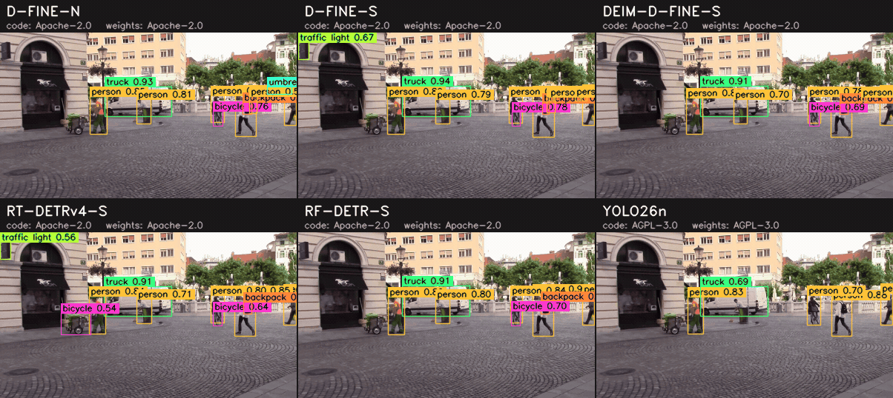
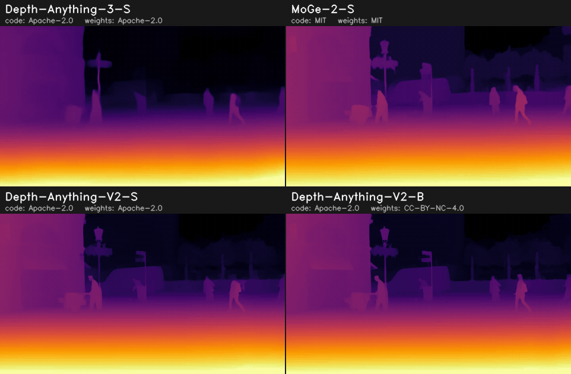
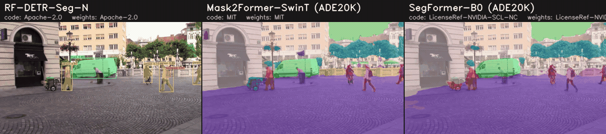

# ml_model_collection

> A collection of reproducible, comparable, and deployment-ready ML models.

Pick a model by **Task × License × Hardware requirements × Runtime** — not by scrolling through hundreds of files.
Every number below was measured by a script in this repo, under the conditions recorded next to it.



<sub>Current real-time SOTA, small sizes: same frames, same tile size, six models ([line-up](object_detection/comparison.yaml), [why these](docs/sota/object_detection.md)). Regenerate with `python tools/make_comparison.py --task object_detection --input assets/demo.mp4`.
Video: "Road traffic on Stritarjeva street" by Sounds of Changes, [CC BY 3.0](https://creativecommons.org/licenses/by/3.0), via [Wikimedia Commons](https://commons.wikimedia.org/wiki/File:Road_traffic_on_Stritarjeva_street.webm) — trimmed, scaled, and annotated with model outputs ([details](assets/README.md)).</sub>

## Object detection

<!-- BEGIN:object_detection_table -->
| Model | Code license | Weights license | Input | COCO mAP<br>(reported) | COCO mAP<br>(measured, ONNX) | Peak VRAM<br>(measured) | GTX 1660 Ti Laptop<br>onnxruntime-cuda FP32 · ms / FPS | Tesla T4 (Colab)<br>onnxruntime-cuda FP32 · ms / FPS | Tesla T4 (Colab)<br>onnxruntime-tensorrt FP16 · ms / FPS |
|---|---|---|---|---|---|---|---|---|---|
| [DEIM-D-FINE-S](object_detection/deim_dfine_s) | 🟢 Apache-2.0 | 🟢 Apache-2.0* | 640×640 | [49.0](https://github.com/Intellindust-AI-Lab/DEIM/blob/09d35d53d39ee3145a1e61e3a989b28b9468d1dd/README.md) | **48.7** | 299 MB (Tiny, CUDA FP32)<br>335 MB (Tiny, CUDA FP32)<br>415 MB (Tiny, TRT FP16) | 21.7 / 46 | 16.7 / 60 | 6.2 / 162 |
| [D-FINE-N](object_detection/dfine_n) | 🟢 Apache-2.0 | 🟢 Apache-2.0 | 640×640 | [42.8](https://github.com/Peterande/D-FINE/blob/956d1709314c2c6a4df6f34de232054578a7449f/README.md) | **42.6** | 177 MB (Tiny, CUDA FP32)<br>219 MB (Tiny, CUDA FP32)<br>405 MB (Tiny, TRT FP16) | 13.4 / 74 | 9.8 / 102 | 5.4 / 184 |
| [D-FINE-S](object_detection/dfine_s) | 🟢 Apache-2.0 | 🟢 Apache-2.0 | 640×640 | [48.5](https://github.com/Peterande/D-FINE/blob/956d1709314c2c6a4df6f34de232054578a7449f/README.md) | **48.3** | 299 MB (Tiny, CUDA FP32)<br>335 MB (Tiny, CUDA FP32)<br>425 MB (Tiny, TRT FP16) | 22.3 / 45 | 17.3 / 58 | 6.8 / 148 |
| [LLMDet-T](object_detection/llmdet_tiny) 🔤 ⚠️ | 🟢 Apache-2.0 | 🟢 Apache-2.0 | 800×1333 | – | **1.5** | 5939 MB (Consumer, CUDA FP32)<br>6257 MB (Consumer, CUDA FP32)<br>1435 MB (Tiny, TRT FP16) | 2655.8 / 0 | 728.6 / 1 | 172.0 / 6 |
| [OWLv2-B/16](object_detection/owlv2_b16) 🔤 | 🟢 Apache-2.0 | 🟢 Apache-2.0 | 960×960 | – | **45.7** | 3477 MB (Light, CUDA FP32)<br>3519 MB (Light, CUDA FP32)<br>763 MB (Tiny, TRT FP16) | 660.1 / 2 | 510.2 / 2 | 84.5 / 12 |
| [RF-DETR-N](object_detection/rfdetr_n) | 🟢 Apache-2.0 | 🟢 Apache-2.0 | 384×384 | [48.4](https://github.com/roboflow/rf-detr/blob/5f441831aaf23a68f40128ad0a2e27cb44e52640/README.md) | **47.9** | 355 MB (Tiny, CUDA FP32)<br>423 MB (Tiny, TRT FP16) | – | 13.2 / 76 | 3.7 / 270 |
| [RF-DETR-S](object_detection/rfdetr_s) | 🟢 Apache-2.0 | 🟢 Apache-2.0 | 512×512 | [53.0](https://github.com/roboflow/rf-detr/blob/5f441831aaf23a68f40128ad0a2e27cb44e52640/README.md) | **52.6** | 489 MB (Tiny, CUDA FP32)<br>433 MB (Tiny, TRT FP16) | – | 24.7 / 40 | 5.6 / 179 |
| [RT-DETR-R18](object_detection/rtdetr_r18vd) | 🟢 Apache-2.0 | 🟢 Apache-2.0 | 640×640 | [46.5](https://huggingface.co/PekingU/rtdetr_r18vd/blob/ac77a11ff0170a41b771c03264987f8ce2b0d753/README.md) | **46.2** | 361 MB (Tiny, CUDA FP32)<br>467 MB (Tiny, TRT FP16) | – | 23.1 / 43 | 6.7 / 149 |
| [RT-DETRv4-M](object_detection/rtdetrv4_m) | 🟢 Apache-2.0 | 🟢 Apache-2.0* | 640×640 | [53.7](https://github.com/RT-DETRs/RT-DETRv4/blob/55fefaaed7efe2a5f72d0a18fd4e05965e35c292/README.md) | **53.5** | 383 MB (Tiny, CUDA FP32)<br>441 MB (Tiny, TRT FP16) | – | 26.9 / 37 | 8.7 / 115 |
| [RT-DETRv4-S](object_detection/rtdetrv4_s) | 🟢 Apache-2.0 | 🟢 Apache-2.0* | 640×640 | [49.8](https://github.com/RT-DETRs/RT-DETRv4/blob/55fefaaed7efe2a5f72d0a18fd4e05965e35c292/README.md) | **49.6** | 335 MB (Tiny, CUDA FP32)<br>415 MB (Tiny, TRT FP16) | – | 16.8 / 59 | 6.8 / 148 |
| [SSDLite320-MobileNetV3](object_detection/ssdlite320_mobilenet_v3_large) | 🟢 BSD-3-Clause | ⚪ unknown | 320×320 | [21.3](https://github.com/pytorch/vision/blob/6da25ff876100d36f23472f5762d5f306c47d735/torchvision/models/detection/ssdlite.py) | **21.1** | 249 MB (Tiny, CUDA FP32) | – | 20.9 / 48 | – |
| [YOLO11n](object_detection/yolo11n) | 🟡 AGPL-3.0 | 🟡 AGPL-3.0* | 640×640 | [39.5](https://github.com/ultralytics/ultralytics/blob/50ca85e03bc669c694c474ab91168f9b5425d9a8/docs/en/models/yolo11.md) | **38.6** | 239 MB (Tiny, CUDA FP32)<br>403 MB (Tiny, TRT FP16) | – | 7.2 / 138 | 4.9 / 205 |
| [YOLO26n](object_detection/yolo26n) | 🟡 AGPL-3.0 | 🟡 AGPL-3.0 | 640×640 | [40.1](https://github.com/ultralytics/ultralytics/blob/50ca85e03bc669c694c474ab91168f9b5425d9a8/README.md) | **40.0** | 247 MB (Tiny, CUDA FP32)<br>401 MB (Tiny, TRT FP16) | – | 8.3 / 121 | 4.5 / 223 |
| [YOLOX-S](object_detection/yolox_s) | 🟢 Apache-2.0 | 🟢 Apache-2.0* | 640×640 | [40.5](https://github.com/Megvii-BaseDetection/YOLOX/blob/6ddff4824372906469a7fae2dc3206c7aa4bbaee/README.md) | **40.3** | 249 MB (Tiny, CUDA FP32)<br>387 MB (Tiny, TRT FP16) | – | 11.2 / 89 | 5.4 / 184 |
<!-- END:object_detection_table -->

- ⚠️ = known issue, see the model's `model.yaml` (`known_issue`) before using it.
- 🔤 = open-vocabulary (prompted with the 80 COCO class names here; COCO AP is zero-shot unless the model's notes say otherwise).
- 🟢 permissive · 🟡 copyleft · 🔴 restricted · ⚪ unknown. `*` = the weights are published from a repository/release under that license, but upstream does not state a separate license for the weights. See [docs/licenses.md](docs/licenses.md).
- **COCO mAP (reported)** is copied from upstream (linked). **COCO mAP (measured, ONNX)** is measured here by [`tools/evaluate.py`](tools/evaluate.py) on COCO val2017 with the *exported ONNX file and this repo's pre/post-processing* (score ≥ 0.001, 100 dets/image, pycocotools) — it checks the artifact you would deploy, not the upstream PyTorch model. For all non-open-vocabulary detectors the two agree within 0.1–0.9 AP.
- **ms / FPS**: mean `session.run` latency, batch 1, ONNX Runtime 1.22, CUDA FP32 or TensorRT FP16 (full conditions in each model's `benchmarks.yaml`). Graphs differ in how much post-processing they contain: DEIM / RT-DETRv4 / YOLO26n include top-k selection, SSDLite includes resize + NMS, the others end at raw predictions (decoded in NumPy, see `e2e_ms_mean` in `benchmarks.yaml`).
- The **TensorRT FP16** column is the closest to upstream "T4 / TensorRT / FP16" tables, but it runs through ONNX Runtime's TensorRT EP and includes whatever post-processing the graph contains, so small differences to upstream numbers are expected.
- **Peak VRAM**: device memory delta during session creation + inference, CUDA context included ([method](docs/hardware.md#how-vram-is-measured)). It is valid only for the listed hardware/runtime/precision/batch/input.

Tables are generated from metadata by `python tools/build_readme.py`; do not edit them by hand.

How these models relate to the current state of the art, and which models are planned next: [docs/sota/object_detection.md](docs/sota/object_detection.md) (surveyed 2026-09-30).

## Depth estimation



<!-- BEGIN:depth_estimation_table -->
| Model | Code license | Weights license | Output | Input | NYUv2 AbsRel ↓<br>(reported) | Peak VRAM<br>(measured) | Tesla T4 (Colab)<br>onnxruntime-cuda FP32 · ms / FPS | Tesla T4 (Colab)<br>onnxruntime-tensorrt FP16 · ms / FPS |
|---|---|---|---|---|---|---|---|---|
| [Depth-Anything-3-S](depth_estimation/depth_anything_3_small) | 🟢 Apache-2.0 | 🟢 Apache-2.0 | relative (depth) | 280×504 | – | 507 MB (Tiny, CUDA FP32)<br>447 MB (Tiny, TRT FP16) | 22.1 / 45 | 5.2 / 192 |
| [Depth-Anything-V2-B](depth_estimation/depth_anything_v2_base) | 🟢 Apache-2.0 | 🔴 CC-BY-NC-4.0 | relative (disparity) | 518×924 | [0.049](https://arxiv.org/abs/2406.09414) | 2099 MB (Light, CUDA FP32)<br>697 MB (Tiny, TRT FP16) | 297.3 / 3 | 48.1 / 21 |
| [Depth-Anything-V2-S](depth_estimation/depth_anything_v2_small) | 🟢 Apache-2.0 | 🟢 Apache-2.0 | relative (disparity) | 518×924 | [0.053](https://arxiv.org/abs/2406.09414) | 1013 MB (Tiny, CUDA FP32)<br>495 MB (Tiny, TRT FP16) | 119.4 / 8 | 18.9 / 53 |
| [MoGe-2-S](depth_estimation/moge2_vits) | 🟢 MIT | 🟢 MIT | metric (m) | 720×1280 | – | 1503 MB (Tiny, CUDA FP32) | 203.4 / 5 | – |
<!-- END:depth_estimation_table -->

Depth-Anything-3-S is the newest (2025-11). Depth-Anything-V2-S and -B share code and architecture, but only **S** has Apache-2.0 weights — **B** is CC-BY-NC-4.0. Relative outputs are per-frame normalised in the GIF. Survey: [docs/sota/depth_estimation.md](docs/sota/depth_estimation.md).

## Segmentation



<!-- BEGIN:segmentation_table -->
| Model | Kind | Code license | Weights license | Input | Accuracy (reported) | Peak VRAM<br>(measured) |
|---|---|---|---|---|---|---|
| [Mask2Former-SwinT (ADE20K)](segmentation/mask2former_swin_t_ade) | semantic | 🟢 MIT | 🟢 MIT* | 512×512 | [47.7](https://github.com/facebookresearch/Mask2Former/blob/9b0651c6c1d5b3af2e6da0589b719c514ec0d69a/MODEL_ZOO.md) ADE20K val mIoU | not measured |
| [RF-DETR-Seg-N](segmentation/rfdetr_seg_n) | instance | 🟢 Apache-2.0 | 🟢 Apache-2.0 | 312×312 | [40.3](https://github.com/roboflow/rf-detr/blob/5f441831aaf23a68f40128ad0a2e27cb44e52640/README.md) COCO val2017 mask AP | not measured |
| [SegFormer-B0 (ADE20K)](segmentation/segformer_b0_ade) | semantic | 🔴 NVIDIA-NC | 🔴 NVIDIA-NC* | 512×512 | [37.4](https://arxiv.org/abs/2105.15203) ADE20K val mIoU | not measured |
<!-- END:segmentation_table -->

Instance (RF-DETR-Seg) and semantic (ADE20K, 150 classes) models side by side. SegFormer-B0 is tiny and has a ready-made ONNX on the Hub, but its code **and** weights are NVIDIA non-commercial — it is here as a license-trap example. Survey: [docs/sota/segmentation.md](docs/sota/segmentation.md).

## Find a model

```console
$ python tools/find_models.py --task object_detection --license permissive --max-latency-ms 20
model         license (code / weights)      hardware          runtime           latency  peak VRAM
deim_dfine_s  🟢 Apache-2.0 / 🟢 Apache-2.0*  Tesla T4 (Colab)  onnxruntime-cuda  16.7 ms  335 MB
dfine_n       🟢 Apache-2.0 / 🟢 Apache-2.0   Tesla T4 (Colab)  onnxruntime-cuda  9.8 ms   219 MB
dfine_s       🟢 Apache-2.0 / 🟢 Apache-2.0   Tesla T4 (Colab)  onnxruntime-cuda  17.3 ms  335 MB
rfdetr_n      🟢 Apache-2.0 / 🟢 Apache-2.0   Tesla T4 (Colab)  onnxruntime-cuda  13.2 ms  355 MB
rtdetrv4_s    🟢 Apache-2.0 / 🟢 Apache-2.0*  Tesla T4 (Colab)  onnxruntime-cuda  16.8 ms  335 MB
yolox_s       🟢 Apache-2.0 / 🟢 Apache-2.0*  Tesla T4 (Colab)  onnxruntime-cuda  11.2 ms  249 MB

* = license inherited from the repository/release; weights have no separate license statement.
```

Filters: `--task`, `--license {permissive,copyleft,restricted}` (applies to code **and** weights; `unknown` never matches), `--max-vram-mb` / `--vram-tier`, `--hardware-class`, `--runtime`, `--max-latency-ms`.
Hardware filters only match **measured** records — nothing is assumed to fit without a benchmark.

## Principles

1. **Compare, don't hoard.** A small number of models with comparable, trustworthy information beats a large number of opaque files.
2. **License per component.** Source code, pretrained weights, training data and runtime dependencies are recorded separately, each with an evidence link. When upstream says nothing, we write `unknown` — we never infer "commercial use OK".
3. **No number without conditions.** VRAM, latency and FPS are only written by [`tools/benchmark.py`](tools/benchmark.py), together with hardware, runtime, precision, batch size, input shape and the artifact's SHA-256. Nothing is estimated.
4. **Reproducible from source.** Each model pins the upstream commit and either downloads a hash-checked file or runs an `export.py`. `weights/provenance.json` records where every artifact came from.
5. **Attributes, not folders.** License, VRAM, hardware, runtime and precision are metadata, not directory levels, so a model never has to be in two places.

### VRAM tiers

| Tier | Peak VRAM | Typical hardware |
|---|---|---|
| Tiny | ≤ 2 GB | Edge devices, iGPU, any discrete GPU |
| Light | ≤ 4 GB | Low-end GPUs, affordable laptops |
| Consumer | ≤ 8 GB | Gaming laptops, mainstream desktop GPUs |
| Performance | ≤ 16 GB | Upper consumer desktop GPUs |
| Large | ≤ 24 GB | High-end consumer GPUs |
| Huge | > 24 GB | Workstation / data center |

A tier is a property of a **measurement**, not of a model: the same model can be Tiny at FP16/batch 1 and Consumer at FP32/batch 16. See [docs/hardware.md](docs/hardware.md).

## Quick start

```bash
pip install -r requirements.txt          # onnxruntime-gpu, opencv, pyyaml, nvidia-ml-py, torch...

# 1. get the ONNX files (download + sha256 check, or export from pinned upstream)
python tools/fetch_model.py --task object_detection
#    Some exporters need extra packages; keep each in its own venv and pass --python
#    (instructions at the top of each model's export.py):
#      yolo11n, yolo26n            -> ultralytics (AGPL-3.0)
#      deim_dfine_s, rtdetrv4_*    -> upstream repo deps (tensorboard, faster-coco-eval, calflops, gdown)
#      rfdetr_*                    -> rfdetr==1.11.0
#    e.g. python tools/fetch_model.py yolo26n --python .venv-ultralytics/Scripts/python

# 2. run one model on a video -> outputs/object_detection/<model>/<clip>/{annotated.mp4,detections.jsonl}
python tools/run_video.py --model yolox_s --input assets/demo.mp4

#    open-vocabulary models take free-text prompts (OWLv2):
python tools/run_video.py --model owlv2_b16 --input assets/demo.mp4 --prompts "delivery van,pedestrian,street lamp"

# 3. rebuild the comparison GIF
python tools/make_comparison.py --task object_detection --input assets/demo.mp4

# 4. benchmark on your machine and contribute the record
#    (--provider cpu | cuda | tensorrt | tensorrt-fp16)
python tools/benchmark.py --task object_detection --provider cuda \
    --hardware-label "RTX 4060 Laptop" --hardware-class gaming_laptop

# 5. measure accuracy of the exported artifact (COCO val2017, pycocotools)
python tools/evaluate.py --task object_detection --coco-root /data/coco

# 6. regenerate tables, validate metadata
python tools/build_readme.py && python tools/validate.py
```

## Layout

```text
ml_model_collection/
├── assets/                  demo clip + generated comparison GIF (with attribution)
├── docs/                    licenses, hardware/VRAM, metadata, adding a model
├── depth_estimation/        same layout; runner file is estimator.py
├── segmentation/            same layout; runner file is segmenter.py
├── object_detection/
│   └── <model>/
│       ├── model.yaml       curated metadata: source, licenses, artifacts, reported accuracy
│       ├── benchmarks.yaml  measured speed / VRAM (generated by tools/benchmark.py)
│       ├── accuracy.yaml    measured accuracy of the artifact (generated by tools/evaluate.py)
│       ├── detector.py      ONNX pre/post-processing -> common Detections output
│       ├── export.py        how the ONNX file is produced (if not downloaded)
│       └── weights/         fetched artifacts + provenance.json (git-ignored)
└── tools/                   fetch, run, compare, benchmark, find, validate, build_readme
```

Other tasks (`pose_estimation/`, `optical_flow/`) will be added when there are models for them. The inner structure of `object_detection/` is deliberately flat for now and will be revisited once more models show what is actually shared ([docs/metadata.md](docs/metadata.md)).

## Contributing

Adding a model or a benchmark on your hardware is the most useful contribution — see [docs/adding_a_model.md](docs/adding_a_model.md).

## License

The code and documentation in this repository are licensed under [Apache-2.0](LICENSE).
**Models are not.** Each model keeps its upstream licenses — check the code *and* weights license of every model before use. Nothing in this repository is legal advice.
