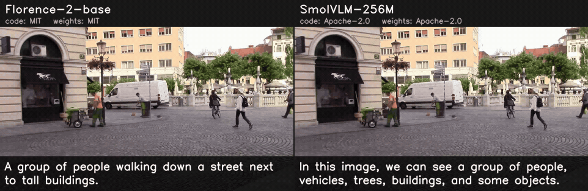

# Image captioning

Every model returns `Caption` (`tools/mlmc/captioning.py`): the generated
text and its token count. Greedy decoding with a KV cache, from plain ONNX
Runtime and the `tokenizers` package.

## Comparison

<!-- BEGIN:image_captioning_table -->
| Model | Code license | Weights license | Training data | Input | COCO Karpathy CIDEr (reported) | COCO Karpathy CIDEr / BLEU-4 (measured, ONNX, greedy) | Peak VRAM (measured) | Tesla T4 (Colab) onnxruntime-cuda FP32 · ms / FPS | Tesla T4 (Colab) onnxruntime-tensorrt FP16 · ms / FPS |
|---|---|---|---|---|---|---|---|---|---|
| [Florence-2-base](florence2_base) | 🟢 MIT | 🟢 MIT | FLD-5B (Microsoft, not released) | 768×768 | [133.0](https://huggingface.co/microsoft/Florence-2-base/blob/5ca5edf5bd017b9919c05d08aebef5e4c7ac3bac/README.md) | **123.6 / 35.1** | 2357 MB (Light, T4 CUDA FP32) 1617 MB (Tiny, T4 TRT FP16) | 154.0 / 6 | 40.5 / 25 |
| [SmolVLM-256M](smolvlm_256m) | 🟢 Apache-2.0 | 🟢 Apache-2.0 | The Cauldron, Docmatix (and SmolLM2 / SigLIP pre-training) | 512×512 | – | **45.5 / 10.9** | 1707 MB (Tiny, T4 CUDA FP32) | 83.2 / 12 | – |
<!-- END:image_captioning_table -->

## Provenance

<!-- BEGIN:image_captioning_provenance -->
| Model | Source (pinned) | Artifact | How it is produced |
|---|---|---|---|
| Florence-2-base | [https://huggingface.co/microsoft/Florence-2-base@5ca5edf](https://huggingface.co/microsoft/Florence-2-base/tree/5ca5edf5bd017b9919c05d08aebef5e4c7ac3bac) | `vision_encoder.onnx` | download 5 files (sha256 pinned) |
| SmolVLM-256M | [https://huggingface.co/HuggingFaceTB/SmolVLM-256M-Instruct@7e3e67e](https://huggingface.co/HuggingFaceTB/SmolVLM-256M-Instruct/tree/7e3e67edbbed1bf9888184d9df282b700a323964) | `vision_encoder.onnx` | download 4 files (sha256 pinned) |
<!-- END:image_captioning_provenance -->

## Per-model notes

- **Florence-2-base** — onnx-community/Florence-2-base (pinned revision,
  SHA-256 per file): vision encoder -> [image features ; embeddings of the
  `<CAPTION>` task prompt "What does the image describe?"] -> encoder ->
  merged decoder (`use_cache_branch`; cross-attention keys / values from the
  first step). fp32 graphs: the repository's fp16 merged decoder does not
  load in ONNX Runtime 1.22 ("subgraph output is an outer scope value") and
  `decoder_with_past` declares a static sequence length. On COCO image
  39769 it produces the same caption as the survey's reference run. The
  reported CIDEr uses beam search (3 beams); here decoding is greedy.
- **SmolVLM-256M** — the official `onnx/` graphs of
  HuggingFaceTB/SmolVLM-256M-Instruct: 512x512 image without splitting
  (64 image tokens), chat prompt "Describe the image in one short sentence.",
  image features substituted for the `<image>` embeddings, merged decoder
  with position ids. A chat model: its captions are longer and phrased
  differently from COCO references.
  On a Colab T4 the TensorRT EP failed to build an engine for its vision
  encoder (2026-10-02), so it has a CUDA record only.

## Evaluation

COCO Captions, Karpathy test split (5000 val2014 images; split file
`dataset_coco.json` from Karpathy's `caption_datasets.zip`, no license
stated), CIDEr-D and BLEU-4 with pycocoevalcap (PTB tokenizer, Java).
COCO annotations CC BY 4.0, images under Flickr terms.
