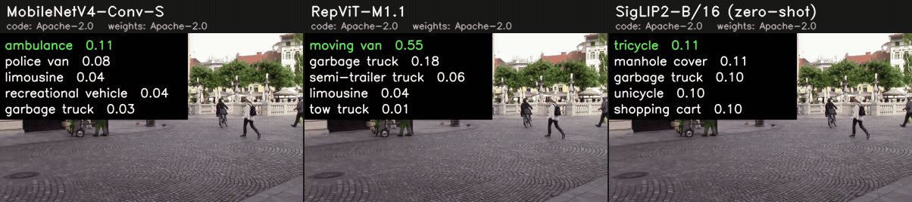

# Image classification

Every model returns `Classes` (`tools/mlmc/classification.py`): top-k
ImageNet-1k class indices, scores (softmax probability, or cosine similarity
for zero-shot models) and names (open_clip's class names,
`tools/mlmc/data/imagenet_classnames.txt`).

## Comparison

<!-- BEGIN:image_classification_table -->
| Model | Kind | Code license | Weights license | Training data | Input | ImageNet-1k top-1 (reported) | ImageNetV2 top-1 (reported) | ImageNetV2 top-1 / top-5 (measured, ONNX) | Peak VRAM (measured) | Tesla T4 (Colab) onnxruntime-cuda FP32 · ms / FPS | Tesla T4 (Colab) onnxruntime-tensorrt FP16 · ms / FPS |
|---|---|---|---|---|---|---|---|---|---|---|---|
| [MobileNetV4-Conv-M](mobilenetv4_conv_medium) | supervised (ImageNet-1k) | 🟢 Apache-2.0 | 🟢 Apache-2.0 | ImageNet-1k | 256×256 | [79.916](https://github.com/huggingface/pytorch-image-models/blob/92dbd9e3f9b5d61c4d008223410781da983239fc/results/results-imagenet.csv) | [69.0](https://github.com/huggingface/pytorch-image-models/blob/92dbd9e3f9b5d61c4d008223410781da983239fc/results/results-imagenetv2-matched-frequency.csv) | **68.9 / 88.64** | 183 MB (Tiny, T4 CUDA FP32) 379 MB (Tiny, T4 TRT FP16) | 2.3 / 431 | 1.4 / 700 |
| [MobileNetV4-Conv-S](mobilenetv4_conv_small) | supervised (ImageNet-1k) | 🟢 Apache-2.0 | 🟢 Apache-2.0 | ImageNet-1k | 224×224 | [73.756](https://github.com/huggingface/pytorch-image-models/blob/92dbd9e3f9b5d61c4d008223410781da983239fc/results/results-imagenet.csv) | [60.9](https://github.com/huggingface/pytorch-image-models/blob/92dbd9e3f9b5d61c4d008223410781da983239fc/results/results-imagenetv2-matched-frequency.csv) | **60.96 / 82.64** | 149 MB (Tiny, T4 CUDA FP32) 363 MB (Tiny, T4 TRT FP16) | 1.5 / 677 | 1.0 / 1008 |
| [RepViT-M1.1](repvit_m1_1) | supervised (ImageNet-1k) | 🟢 Apache-2.0 | 🟢 Apache-2.0 | ImageNet-1k | 224×224 | [81.314](https://github.com/huggingface/pytorch-image-models/blob/92dbd9e3f9b5d61c4d008223410781da983239fc/results/results-imagenet.csv) | [70.37](https://github.com/huggingface/pytorch-image-models/blob/92dbd9e3f9b5d61c4d008223410781da983239fc/results/results-imagenetv2-matched-frequency.csv) | **70.29 / 89.18** | 175 MB (Tiny, T4 CUDA FP32) 373 MB (Tiny, T4 TRT FP16) | 2.6 / 377 | 1.7 / 591 |
| [SigLIP2-B/16 (zero-shot)](siglip2_b16_224) | zero-shot (image-text) | 🟢 Apache-2.0 | 🟢 Apache-2.0 | WebLI (Google, not released) | 224×224 | [78.2](https://arxiv.org/abs/2502.14786) | [71.4](https://arxiv.org/abs/2502.14786) | – | not measured | – | – |
<!-- END:image_classification_table -->

## Provenance

<!-- BEGIN:image_classification_provenance -->
| Model | Source (pinned) | Artifact | How it is produced |
|---|---|---|---|
| MobileNetV4-Conv-M | [huggingface/pytorch-image-models@92dbd9e](https://github.com/huggingface/pytorch-image-models/tree/92dbd9e3f9b5d61c4d008223410781da983239fc) | `mobilenetv4_conv_medium.onnx` | download `model.onnx` (sha256 pinned) |
| MobileNetV4-Conv-S | [huggingface/pytorch-image-models@92dbd9e](https://github.com/huggingface/pytorch-image-models/tree/92dbd9e3f9b5d61c4d008223410781da983239fc) | `mobilenetv4_conv_small.onnx` | download `model.onnx` (sha256 pinned) |
| RepViT-M1.1 | [THU-MIG/RepViT@298f420](https://github.com/THU-MIG/RepViT/tree/298f42075eda5d2e6102559fad260c970769d34e) | `repvit_m1_1.onnx` | [`export.py`](repvit_m1_1/export.py) |
| SigLIP2-B/16 (zero-shot) | [google-research/big_vision@0127fb6](https://github.com/google-research/big_vision/tree/0127fb6b337ee2a27bf4e54dea79cff176527356) | `siglip2_b16_224.onnx` | [`export.py`](siglip2_b16_224/export.py) |
<!-- END:image_classification_provenance -->

## Per-model notes

- **MobileNetV4-Conv-S / -M** — onnx-community exports of the timm
  checkpoints (pinned revisions, SHA-256), `pixel_values -> logits`.
- **RepViT-M1.1** — exported from timm with the pinned checkpoint and
  structural re-parameterisation (as timm's `onnx_export.py --reparam`); the
  ONNX matches the un-re-parameterised PyTorch model to 1.2e-5.
- **SigLIP 2 B/16-224 (zero-shot)** — onnx-community image tower +
  `imagenet_text_embeddings.npy` computed by `export.py` from the official
  checkpoint (open_clip class names x 7 simple templates, lower-cased, 64
  tokens), so the 1.1 GB text tower is not needed at run time. Which prompt
  set the paper used is not stated (unverified); the measured number uses
  these 7 templates.

Preprocessing follows each checkpoint's evaluation config (timm: PIL
bicubic resize of the shorter side to size / crop_pct and centre crop;
SigLIP 2: direct 224x224 bilinear resize, mean / std 0.5).

## Evaluation

ImageNetV2 matched-frequency (10,000 images, Hugging Face
vaishaal/ImageNetV2, pinned revision; MIT tag, Flickr images): top-1 /
top-5, label = integer folder name. The reported ImageNetV2 numbers are from
timm's results CSV and the SigLIP 2 paper.
