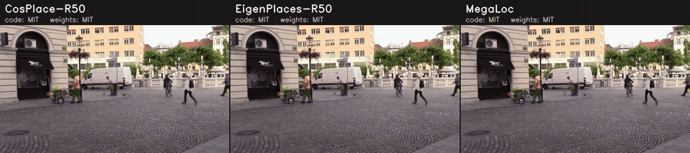

# Visual place recognition

Every model returns `Descriptor` (`tools/mlmc/place_recognition.py`): one
L2-normalised global descriptor per image; places are retrieved by cosine
similarity.

## Comparison

<!-- BEGIN:place_recognition_table -->
| Model | Code license | Weights license | Training data | Descriptor | Input | Pitts30k / Tokyo24/7 R@1 (reported) | SPED R@1 / R@5 (measured, ONNX) | Peak VRAM (measured) | Tesla T4 (Colab) onnxruntime-cuda FP32 · ms / FPS | Tesla T4 (Colab) onnxruntime-tensorrt FP16 · ms / FPS |
|---|---|---|---|---|---|---|---|---|---|---|
| [CosPlace-R50](cosplace_r50) | 🟢 MIT | 🟢 MIT* | SF-XL (San Francisco eXtra Large) | 2048-D | native | [90.9 / 87.3](https://arxiv.org/abs/2502.17237) | – | 349 MB (Tiny, T4 CUDA FP32) 427 MB (Tiny, T4 TRT FP16) | 22.4 / 45 | 3.7 / 271 |
| [EigenPlaces-R50](eigenplaces_r50) | 🟢 MIT | 🟢 MIT* | SF-XL (San Francisco eXtra Large) | 2048-D | native | [92.5 / 93.0](https://arxiv.org/abs/2502.17237) | – | 349 MB (Tiny, T4 CUDA FP32) 427 MB (Tiny, T4 TRT FP16) | 21.9 / 46 | 3.7 / 272 |
| [MegaLoc](megaloc) | 🟢 MIT | 🟢 MIT | SF-XL, GSV-Cities, MSLS, MegaScenes, ScanNet | 8448-D | 322×322 | [94.1 / 96.5](https://arxiv.org/abs/2502.17237) | – | 1229 MB (Tiny, T4 CUDA FP32) 793 MB (Tiny, T4 TRT FP16) | 43.3 / 23 | 9.1 / 110 |
<!-- END:place_recognition_table -->

## Provenance

<!-- BEGIN:place_recognition_provenance -->
| Model | Source (pinned) | Artifact | How it is produced |
|---|---|---|---|
| CosPlace-R50 | [gmberton/CosPlace@52b56e9](https://github.com/gmberton/CosPlace/tree/52b56e95ea62245281281f3bafd7b9390d19a0fd) | `cosplace_r50.onnx` | [`export.py`](cosplace_r50/export.py) |
| EigenPlaces-R50 | [gmberton/EigenPlaces@a2969f7](https://github.com/gmberton/EigenPlaces/tree/a2969f71d5ea31017443af490b15273ca4c50af1) | `eigenplaces_r50.onnx` | [`export.py`](eigenplaces_r50/export.py) |
| MegaLoc | [gmberton/MegaLoc@5fe0dd6](https://github.com/gmberton/MegaLoc/tree/5fe0dd697c4a70ba3e23607f6716ab3c606b16db) | `megaloc.onnx` | download `megaloc.onnx` (sha256 pinned) |
<!-- END:place_recognition_provenance -->

## Per-model notes

- **CosPlace-R50 / EigenPlaces-R50** — the official `GeoLocalizationNet`
  classes at pinned commits with the v1.0 release checkpoints (SHA-256
  pinned). Building the network upstream downloads backbone weights that
  the checkpoint overwrites; the export skips that. GeM's
  `avg_pool2d(kernel = H x W)` is exported as the equivalent
  `adaptive_avg_pool2d(1)`, so the graph takes any input size; ONNX matches
  PyTorch (original GeM) to 3e-7 at 206x305 and 360x640. Evaluation at
  native resolution (as upstream); video frames are capped at 640 px.
- **MegaLoc** — official `megaloc.onnx` from gberton/MegaLoc (pinned
  revision), 322x322 input, 8448-D.

## Evaluation

SPED test (607 queries / 607 references; seasonal and day / night change),
Recall@1/5/10 with query i matching reference i. 44 MB, no registration;
license not stated (unverified). Pitts30k / Tokyo 24/7 (the reported
columns) need permission requests.
