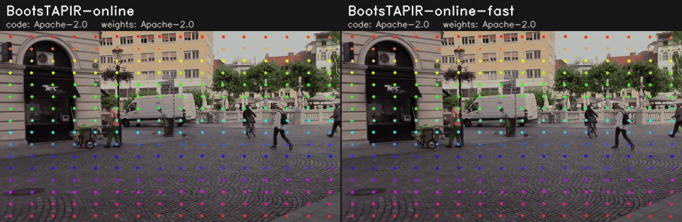

# Point tracking

Every model returns `PointTracks` (`tools/mlmc/point_tracking.py`): the
position (x, y, source pixels) and visibility of each tracked point in the
current frame. Runners are stateful: on the first frame they start a 16x16
grid of points.

## Comparison

<!-- BEGIN:point_tracking_table -->
| Model | Kind | Code license | Weights license | Input | TAP-Vid DAVIS first AJ (reported) | TAP-Vid DAVIS first AJ / δavg / OA (measured, ONNX) | Peak VRAM (measured) | Tesla T4 (Colab) onnxruntime-tensorrt FP16 · ms / FPS |
|---|---|---|---|---|---|---|---|---|
| [BootsTAPIR-online](bootstapir_online) | online (causal) | 🟢 Apache-2.0 | 🟢 Apache-2.0 | 256×256, 256 points | [59.7](https://github.com/google-deepmind/tapnet/blob/730cda1c730877cfedbe01bf87fb1cadb78a565d/README.md) | **59.3 / 71.6 / 87.2** | 1975 MB (Tiny, T4 TRT FP16) | 200.9 / 5 |
| [BootsTAPIR-online-fast](bootstapir_online_fast) | online (causal) | 🟢 Apache-2.0 | 🟢 Apache-2.0 | 256×256, 256 points | – | **53.9 / 66.1 / 80.9** | 881 MB (Tiny, T4 TRT FP16) | 51.8 / 19 |
<!-- END:point_tracking_table -->

## Provenance

<!-- BEGIN:point_tracking_provenance -->
| Model | Source (pinned) | Artifact | How it is produced |
|---|---|---|---|
| BootsTAPIR-online | [google-deepmind/tapnet@730cda1](https://github.com/google-deepmind/tapnet/tree/730cda1c730877cfedbe01bf87fb1cadb78a565d) | `bootstapir_online.onnx` | [`export.py`](bootstapir_online/export.py) |
| BootsTAPIR-online-fast | [google-deepmind/tapnet@730cda1](https://github.com/google-deepmind/tapnet/tree/730cda1c730877cfedbe01bf87fb1cadb78a565d) | `bootstapir_online_fast.onnx` | [`export.py`](bootstapir_online_fast/export.py) |
<!-- END:point_tracking_provenance -->

## Implementation

DeepMind's `causal_bootstapir_checkpoint.pt` (Apache-2.0, SHA-256 pinned)
exported with ibaiGorordo/Tapir-Pytorch-Inference (Apache-2.0 port of
tapnet's PyTorch TAPIR, pinned commit) as two graphs:

- `*_encoder.onnx` — query features of points (y, x normalised) from a
  frame's feature grids;
- `*.onnx` — one frame: RGB 256x256 in [-1, 1] + query features + causal
  state `[iters, 12, 256, 2, 2560]` -> tracks, visibility, new state and the
  frame's feature grids.

The port's reshapes bake in the number of points, so the graphs are fixed
at 256 points (evaluation pads / chunks query sets). Against the PyTorch
port on the demo clip the ONNX tracks differ by 0.1-0.2 px median at
256x256 (p95 < 0.8 px); visibility agrees on > 99 % of points.

## Known issues

- **CUDA EP on a Colab T4 (2026-10-02):** with ONNX Runtime 1.22 the
  per-frame graph's CUDA session builds in about 1 s (cuDNN 9.10), but
  inference then stays at 100 % CPU with the GPU idle for more than 30
  minutes, with both cuDNN 9.27 (Colab default) and 9.10. The T4 benchmark
  and the TAP-Vid evaluation are therefore missing; the cause is not yet
  known. The CPU EP runs the graph (parity numbers above).
- **TensorRT EP:** the engine builds and runs (FP16, T4): about 200 ms per
  frame for BootsTAPIR-online and 52 ms for -fast. The TAP-Vid numbers are
  therefore measured through TensorRT FP16 (AJ 59.3 vs 59.7 reported).

## Evaluation

TAP-Vid DAVIS (30 videos), 'first' query mode at 256x256 as tapnet's
evaluation: each point is queried at its first visible frame; average
Jaccard (AJ), delta_avg and occlusion accuracy over the frames after the
query, averaged over videos. The tracker runs causally from frame 0 with
query features taken from each query's frame. TAP-Vid annotations are
CC BY 4.0; the DAVIS frames carry their creators' licenses (unverified).
