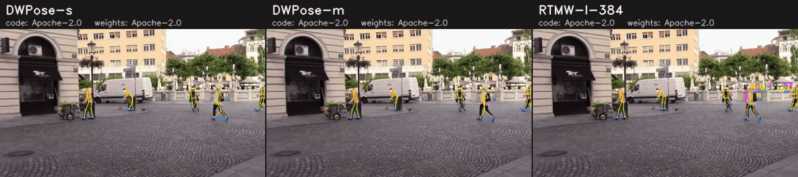

# Whole-body pose

Runners return `Poses` (`tools/mlmc/pose.py`) with 133 keypoints per
person in the COCO-WholeBody layout (`tools/mlmc/wholebody.py`: body 0-16,
feet 17-22, face 23-90, left hand 91-111, right hand 112-132).

## Comparison

<!-- BEGIN:wholebody_pose_table -->
| Model | Code license | Weights license | Training data | Input | Whole / body / hand AP (reported, COCO-WholeBody val) | Whole / body / foot / face / hand AP (measured, ONNX, D-FINE-N boxes) | Peak VRAM (measured) |
|---|---|---|---|---|---|---|---|
| [DWPose-m](dwpose_m) | 🟢 Apache-2.0 | 🟢 Apache-2.0* | COCO-WholeBody + UBody | 256×192 | [60.6 / 68.5 / 52.7](https://github.com/IDEA-Research/DWPose/blob/3dca5db79d9f9ffdd378753ddf6ec66535aace88/README.md) | – | not measured |
| [DWPose-s](dwpose_s) | 🟢 Apache-2.0 | 🟢 Apache-2.0* | COCO-WholeBody + UBody | 256×192 | [53.8 / 63.3 / 42.7](https://github.com/IDEA-Research/DWPose/blob/3dca5db79d9f9ffdd378753ddf6ec66535aace88/README.md) | – | not measured |
| [RTMW-l-384](rtmw_l_384) | 🟢 Apache-2.0 | 🟢 Apache-2.0* | Cocktail14 | 384×288 | [70.1 / 76.1 / 66.3](https://github.com/open-mmlab/mmpose/blob/759b39c13fea6ba094afc1fa932f51dc1b11cbf9/configs/wholebody_2d_keypoint/rtmpose/cocktail14/rtmw_cocktail14.md) | – | not measured |
<!-- END:wholebody_pose_table -->

## Provenance

<!-- BEGIN:wholebody_pose_provenance -->
| Model | Source (pinned) | Artifact | How it is produced |
|---|---|---|---|
| DWPose-m | [IDEA-Research/DWPose@3dca5db](https://github.com/IDEA-Research/DWPose/tree/3dca5db79d9f9ffdd378753ddf6ec66535aace88) | `dwpose_m.onnx` | download `rtmpose-m_simcc-ucoco_dw-ucoco_270e-256x192-c8b76419_20230728.zip`, extract `end2end.onnx` (sha256 pinned) |
| DWPose-s | [IDEA-Research/DWPose@3dca5db](https://github.com/IDEA-Research/DWPose/tree/3dca5db79d9f9ffdd378753ddf6ec66535aace88) | `dwpose_s.onnx` | download `rtmpose-s_simcc-ucoco_dw-ucoco_270e-256x192-3fd922c8_20230728.zip`, extract `end2end.onnx` (sha256 pinned) |
| RTMW-l-384 | [open-mmlab/mmpose@759b39c](https://github.com/open-mmlab/mmpose/tree/759b39c13fea6ba094afc1fa932f51dc1b11cbf9) | `rtmw_l_384.onnx` | download `rtmw-dw-x-l_simcc-cocktail14_270e-384x288_20231122.zip`, extract `end2end.onnx` (sha256 pinned) |
<!-- END:wholebody_pose_provenance -->

## Per-model notes

Official mmpose / mmdeploy ONNX SDK archives (archive and member SHA-256
pinned), run with the RTMPose top-down runner of `pose_estimation/rtmpose_s`
(padding 1.25, affine crop, RGB, mmpose mean / std, SimCC split ratio 2) on
D-FINE-N person boxes. On COCO image 785 the body keypoints agree with
RTMPose-s to ~2 px (median).

- **DWPose-s / -m** — IDEA's distilled RTMPose (COCO-WholeBody + UBody).
- **RTMW-l-384** — `rtmw-dw-x-l_simcc-cocktail14_270e-384x288` (the
  archive's `pipeline.json` still states 192x256; the graph is 384x288).
  Its SimCC confidences are not normalised (values above 1), so its scores
  are on a different scale from DWPose's (the rendering threshold still
  applies).
- The mmpose README's RTMW-m ONNX link points to `rtmw-dw-m-s` (an s-width
  network); the real RTMW-m archive is `rtmw-dw-l-m`.

## Evaluation

COCO-WholeBody v1.0 val (`coco_wholebody_val_v1.0.json`, research /
non-commercial terms) on COCO val2017 images, xtcocotools with the per-part
sigmas (`tools/mlmc/data/coco_wholebody_sigmas.py`), one COCOeval per part
as mmpose `CocoWholeBodyMetric`. Person boxes come from D-FINE-N
(end-to-end), whereas the reported numbers use mmpose's AP_H_56 detections.
